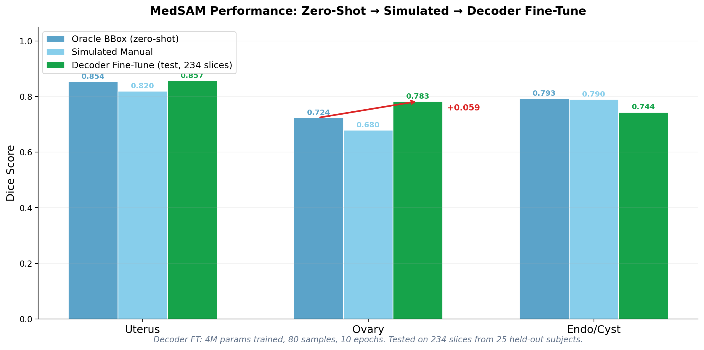
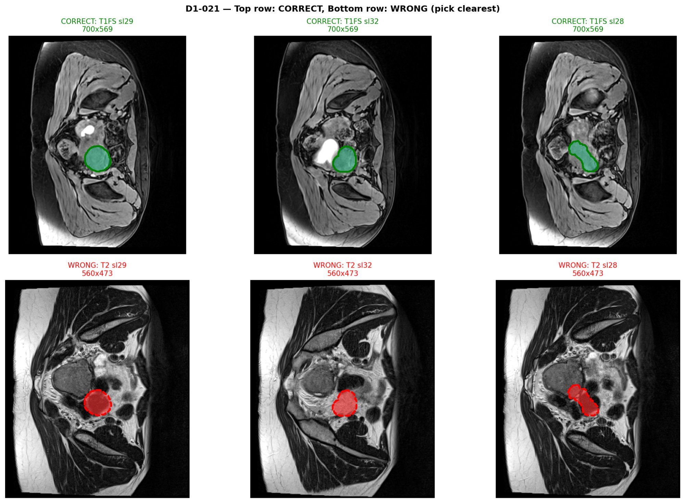
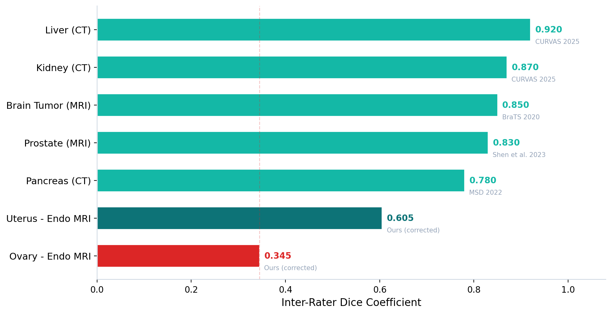
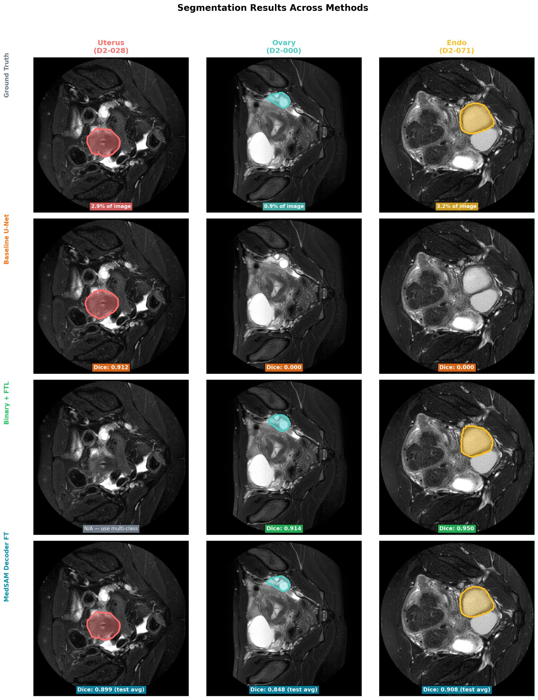

# EndoSAM — Pelvic Organ Segmentation for Endometriosis Diagnosis

> **Segmenting uterus, ovary, and endometrioma in pelvic MRI — and finding that a data-alignment bug, not the model, was the real bottleneck.**

Deep-learning segmentation pipeline on the UT-EndoMRI dataset (124 subjects, two hospitals), supporting non-invasive endometriosis diagnosis. ENGG\*6302 Image Processing, University of Guelph — supervised by Prof. Eran Ukwatta (Imaging AI Lab). Presented March 31, 2026 (graded 90+).

**MedSAM decoder fine-tuned: 0.857 / 0.783 / 0.744 Dice** (uterus / ovary / endometrioma). First MedSAM evaluation on this dataset; first endometrioma segmentation result.

---

## Results at a glance

| Method | Uterus | Ovary | Endometrioma |
|---|---|---|---|
| **MedSAM decoder fine-tuned** | **0.857** | **0.783** | **0.744** |
| MedSAM simulated manual box | 0.805 | 0.683 | 0.641 |
| Binary U-Net + Focal Tversky | — | 0.298 | 0.556 |
| Multi-class U-Net (baseline) | 0.656 | 0.000 | 0.000 |
| RAovSeg (published baseline) | — | 0.290 | — |
| Inter-rater (human radiologists) | 0.605 | 0.345 | — |

## The single largest improvement was a data fix, not a model

**52 % of subjects had mask-to-image spatial misalignment** from multi-sequence MRI acquisition. Fixing it lifted MedSAM uterus Dice from **0.356 → 0.842** — a +0.486 jump that exceeds the contribution of any architectural change. This is the most important finding for anyone using UT-EndoMRI.

## Why ovary segmentation is genuinely hard

Even radiologists disagree heavily on ovary boundaries — measured inter-rater Dice is just **0.345**, lower than liver (0.92), kidney (0.87), or prostate (0.83). That's a ground-truth ceiling: model accuracy can't meaningfully exceed human agreement. Notably, MedSAM with a usable prompt reaches 0.683–0.783 — *above* the inter-rater ceiling.

## Qualitative results

## Read more

- 📄 **[Full report (PDF)](report/EndoSAM_FinalReport.pdf)**
- 🔬 [Methodology](docs/methodology.md) · [Results](docs/results.md) · [References](docs/references.md)

## A note on code

Solution code is kept private in line with course academic-integrity policy. I'm happy to walk through the implementation, the alignment-fix, and the MedSAM fine-tuning approach with anyone interested — just reach out.

## Author

**Antony Gerold Arockiasamy** · MEng Computer Engineering, University of Guelph · ENGG\*6302, supervised by Prof. Eran Ukwatta.

## License

Documentation and figures: MIT — see [LICENSE](LICENSE).
